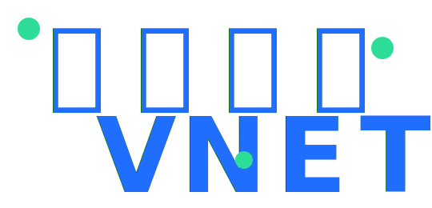
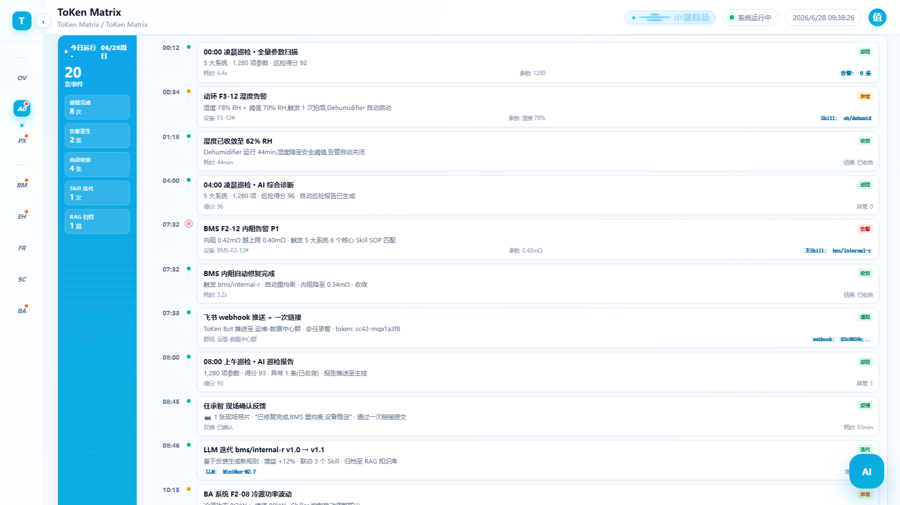
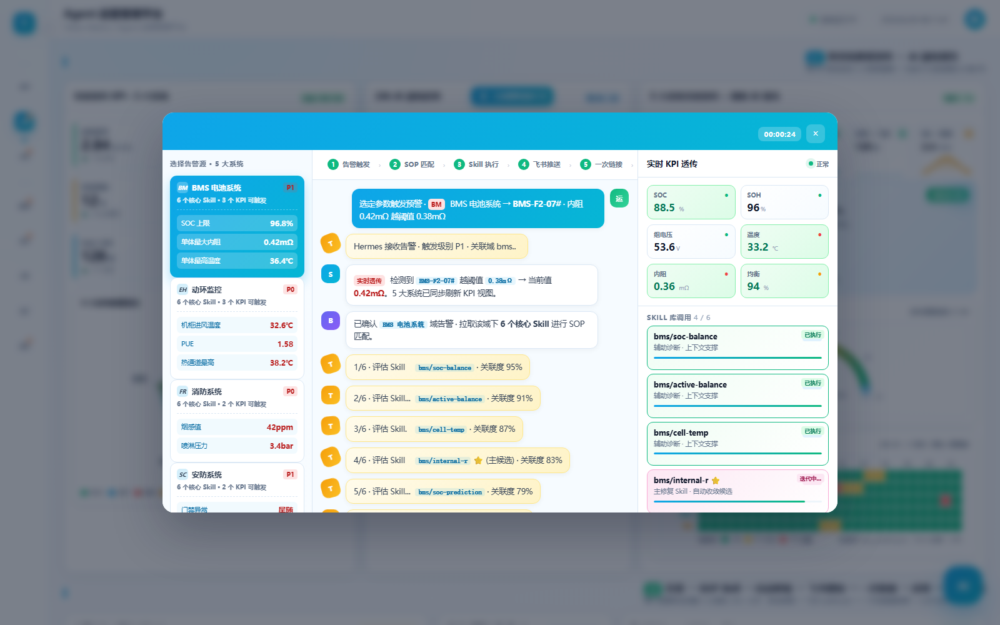
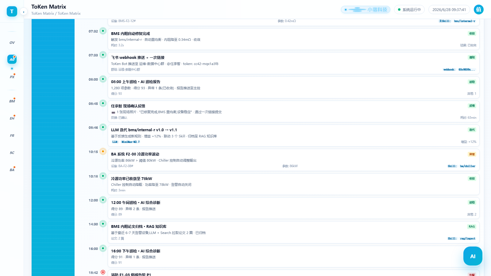

<div align="center">


&nbsp;&nbsp;&nbsp;&nbsp;&nbsp;&nbsp;


# ToKen Matrix

### 小宿科技原生 AI Token 孵化器 · 数据中心智能运维 AI Agent 系统

> 告别"人盯告警"，迈向"系统自动驾驶"
> 感知 → 决策 → 执行 → 反思，每一次告警都让 Skill 自我升级

<br/>

[](https://www.python.org)
[](https://fastapi.tiangolo.com)
[](https://api.minimaxi.com)
[](https://open.feishu.cn)
[](LICENSE)
[](https://github.com/renvvvvv/ToKen-Matrix)

[English](./README_EN.md) · [快速开始](#-快速开始) · [功能演示](#-功能演示) · [架构设计](#-架构设计) · [贡献指南](#-贡献指南)

</div>

---

## ✨ 为什么是 ToKen Matrix？

传统数据中心运维是 **"规则 → 告警 → 人处理"** 的被动响应模式。ToKen Matrix 构建了 **"感知 → 决策 → 执行 → 反思"** 的智能闭环，让机房真正实现 7×24 小时 **AI Agent 自动驾驶**。

| 维度 | 传统运维 | ToKen Matrix |
|---|---|---|
| 告警响应 | 人工轮询，平均 30min+ | AI 实时感知，**秒级**触发 |
| 处置方式 | 经验 + SOP 手册 | **80+ Hermes 原子技能** 自动匹配 |
| 知识沉淀 | 师傅带徒弟，口口相传 | LLM 反思 → **Skill 自我迭代** v1.0→v3.1 |
| 协同入口 | 邮件 / 电话 / 工单 | **飞书群** + 一次性确认链接 + openclaw 卡片 |
| 数据决策 | 人工看报表 | 24h 趋势巡检 + 主动降载 + 异常收敛 |

## 🎯 核心特性

- 🧠 **LLM 驱动 Skill 自迭代** — 每次告警处置后，LLM 反思沉淀经验，Skill 自动出 v1.1 / v1.2 / v1.5 新版本（已沉淀 8+ 次迭代）
- 🏗️ **五层架构 L1-L5** — 数据设备 → 适配层 → Hermes 场景引擎 → 工单层 → 总部大脑，全栈可观测
- 🛡️ **五大子系统全覆盖** — BMS 电池 / 动环监控 / 消防 / 安防 / BA 楼宇，每个子系统 16+ 原子技能
- 🔄 **7 步告警处置闭环** — 检测 → 分类 → SOP 匹配 → Skill 执行 → 飞书推送 → 现场反馈 → LLM 反思
- 📊 **24h AI 主动巡检** — 13 条分时记录、全维度趋势、异常自收敛，从"被动接告警"到"主动找问题"
- 🌐 **多端无缝协同** — Web 控制台 (Apple 极简风) + 飞书机器人 + openclaw 卡片，移动端随时响应

## 🏗️ 架构设计

```
┌──────────────────────────────────────────────────────────────┐
│ L5  总部大脑   │  全局策略 · 跨域协同 · 自学习               │
├──────────────────────────────────────────────────────────────┤
│ L4  工单层     │  任务编排 · 流程引擎 · SLA 管控             │
├──────────────────────────────────────────────────────────────┤
│ L3  Hermes     │  场景引擎 · 80+ Skill · RAG 知识库          │
├──────────────────────────────────────────────────────────────┤
│ L2  适配层     │  多协议接入 · 数据清洗 · 设备抽象           │
├──────────────────────────────────────────────────────────────┤
│ L1  数据设备   │  BMS · 动环 · 消防 · 安防 · BA 传感器       │
└──────────────────────────────────────────────────────────────┘
```

> 💡 **设计哲学**：每一层都只做一件事，但做到极致。LLM 出现在 L3 + L5 两个关键节点 — L3 用于 Skill 反思迭代，L5 用于跨域决策。

## 🛡️ 五大子系统

| 域 | 子系统 | 代号 | 核心技能数 | 代表场景 |
|---|---|---|:---:|---|
| 🔋 | **BMS 电池系统** | BM | 16+ | SOC 平衡 · 内阻诊断 · SOH 估算 · 温度预警 |
| 🌡️ | **动环监控** | EH | 16+ | PUE 实时 · 冷热通道 · 露点检测 · 预测维护 |
| 🚨 | **消防系统** | FR | 17+ | 烟感联动 · 喷淋分区 · 气体灭火 · 疏散路径 |
| 🔐 | **安防系统** | SC | 16+ | 门禁反潜 · 访客管理 · 视频联动 · 巡更路线 |
| 🏢 | **BA 楼宇** | BA | 16+ | 冷源优化 · VAV 控制 · 照明场景 · 能耗预算 |

每个子系统都提供 **banner + 5 KPI + 趋势图 + 环形/堆叠/聚类图 + 事件流 + 技能沉淀 + 20 行时序表** 的标准化看板。

## 📸 功能演示

### 系统总览 · 24h AI 主动巡检


### 主动巡检 · 7 步闭环演示


### Agent 运营平台 · Skill 迭代记录


> 📂 完整截图：[`backend/screenshots/`](backend/screenshots/) · 录制视频：[`docs/demos/`](docs/demos/)

## 🚀 快速开始

### 方式 1 · 本地直接运行（30 秒）

```bash
# 克隆仓库
git clone https://github.com/renvvvvv/ToKen-Matrix.git
cd ToKen-Matrix

# 启动后端服务 (FastAPI)
cd backend
pip install -r requirements.txt
python main.py
```

打开浏览器访问：**http://127.0.0.1:8766/console.html**

### 方式 2 · Docker 一键启动（5 分钟）

```bash
cd ToKen-Matrix
cp .env.example .env       # 配置 LLM Key / 飞书 Webhook
docker-compose up -d
```

| 服务 | 地址 |
|---|---|
| 主控台 | http://localhost:3000 |
| 后端 API | http://localhost:8000 |
| API 文档 | http://localhost:8000/docs |

### 方式 3 · 仅看 Demo（纯静态）

```bash
cd ToKen-Matrix/frontend
python -m http.server 8000
# 访问 http://localhost:8000
```

## 🔑 环境变量配置

复制 `.env.example` 为 `.env`，至少配置以下两项：

```bash
# LLM（用于 Skill 反思迭代）
LLM_API_KEY=your-llm-api-key
LLM_BASE_URL=https://api.minimaxi.com/v1
LLM_MODEL=MiniMax-M2.7-highspeed

# 飞书 Webhook（告警推送）
FEISHU_WEBHOOK_URL=https://open.feishu.cn/open-apis/bot/v2/hook/your-token
```

> ⚠️ 真实 Webhook / API Key **绝不** 入库。前端通过 `config.local.js` 注入（已在 `.gitignore` 中排除）。

## 🛠️ 技术栈

| 层 | 技术 |
|---|---|
| 前端 | HTML / CSS / JS · Apple 极简风 · 纯静态无构建 |
| 后端 | FastAPI · Pydantic · httpx |
| LLM | MiniMax-M2.7-highspeed（OpenAI 兼容协议） |
| 协同 | 飞书 Webhook · 一次性确认链接 · openclaw 卡片 |
| 部署 | Docker · Docker Compose · Nginx |

## 🗺️ Roadmap

- [x] ✅ 五大子系统基线能力
- [x] ✅ 80+ Hermes 原子技能 + 多版本迭代
- [x] ✅ 7 步告警处置闭环
- [x] ✅ 24h 主动巡检 + 异常收敛
- [ ] 🚧 跨域联合决策引擎 (L5)
- [ ] 🚧 多机房联邦学习
- [ ] 🔮 数字孪生 3D 可视化
- [ ] 🔮 语音 / 视频多模态巡检

## 🤝 贡献指南

我们欢迎所有形式的贡献：

1. **Fork** 本仓库
2. 创建特性分支 (`git checkout -b feature/AmazingFeature`)
3. 提交改动 (`git commit -m 'feat: add some amazing feature'`)
4. 推送分支 (`git push origin feature/AmazingFeature`)
5. 提交 **Pull Request**

每个新 Skill 需要包含：`SKILL.md` + `v1.0.py` + `eval/test_v1.0.py` + `archive/README.md`。

## 📄 许可证

本项目基于 **Apache 2.0** 许可证开源 — 详见 [LICENSE](LICENSE) 文件。

## 🙏 致谢

- **合作方**：[世纪互联 VNET](https://www.vnet.com) — 提供数据中心基础设施与场景支持
- **技术栈**：FastAPI · MiniMax · 飞书开放平台
- **社区**：所有为 ToKen Matrix 提交 Issue / PR / Star 的朋友们 ⭐

---

<div align="center">

**🌟 如果这个项目对你有帮助，请给我们一个 Star！**

<sub>Built with ❤️ by 小宿科技 · Powered by 世纪互联</sub>

</div>
